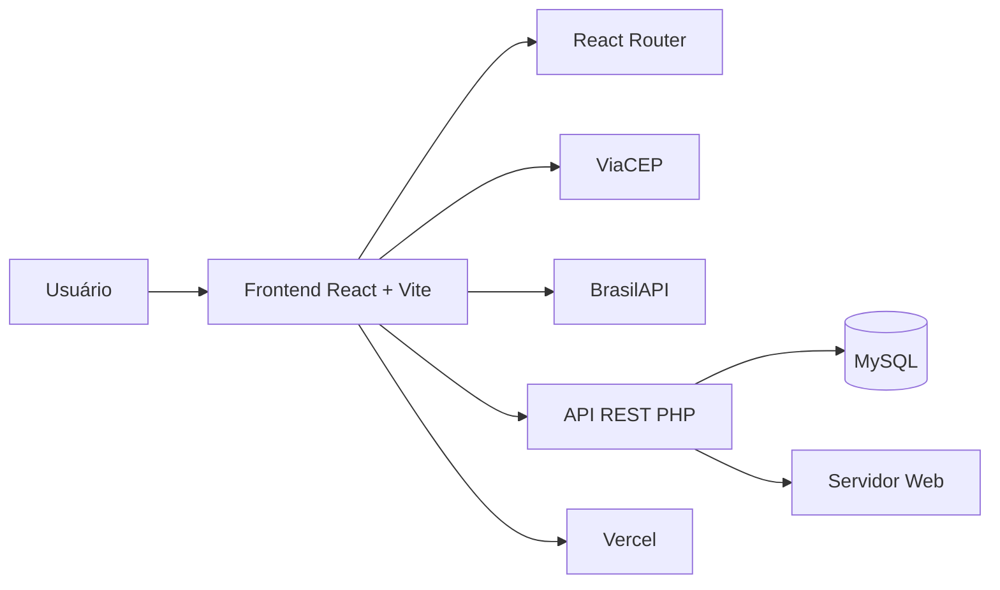

# 🏢 CondoPrime

> Painel interativo de gestão condominial desenvolvido com **React + Vite**, com consumo de APIs públicas, interface responsiva e publicação na Vercel.

<p align="center">
  <a href="https://condo-prime.vercel.app">
    <strong>🌐 Acessar aplicação publicada</strong>
  </a>
  &nbsp;•&nbsp;
  <a href="https://github.com/Darknen/Projeto-2">
    <strong>💻 Ver repositório no GitHub</strong>
  </a>
</p>

<p align="center">
  
  
  
  
  
  
</p>

---

## 📖 Sobre o projeto

O **CondoPrime** é uma aplicação web criada para organizar e apresentar informações relacionadas à gestão de condomínios de forma simples, visual e interativa.

O sistema reúne em uma única interface dados de condomínios, unidades, moradores, veículos, funcionários e fornecedores, permitindo consultas, cadastros, edições e exclusões.

Além da API própria utilizada pelo sistema, o projeto consome **APIs públicas** para automatizar consultas e reduzir o preenchimento manual de informações.

---

## 💡 Problemática

Informações administrativas de condomínios podem ficar dispersas entre planilhas, documentos, cadastros isolados e diferentes fontes de consulta.

Isso dificulta tarefas simples, como:

- localizar dados de um condomínio;
- identificar moradores vinculados a uma unidade;
- consultar veículos;
- organizar funcionários e fornecedores;
- preencher endereços;
- consultar dados de empresas.

A proposta do CondoPrime é transformar essas informações em uma aplicação centralizada, organizada e interativa, facilitando a consulta e o gerenciamento dos dados.

---

## 🎯 Objetivo da aplicação

Desenvolver uma aplicação web em **React + Vite** capaz de organizar informações condominiais e consumir dados de APIs públicas de forma clara e funcional.

O projeto busca demonstrar:

- consumo de APIs públicas;
- tratamento e utilização dos dados recebidos;
- criação de componentes reutilizáveis;
- organização da aplicação em páginas e módulos;
- interação do usuário com os dados;
- responsividade;
- integração entre frontend e backend;
- versionamento com Git e GitHub;
- publicação em ambiente web.

---

## 👤 Usuário da aplicação

O sistema foi pensado para usuários responsáveis pela administração de condomínios, que precisam consultar e organizar informações de forma rápida e centralizada.

Exemplos:

- administradores;
- síndicos;
- equipes administrativas;
- responsáveis por cadastros e controle operacional.

---

## 🔌 APIs públicas utilizadas

### 📍 ViaCEP

A **ViaCEP** é utilizada para consultar automaticamente informações de endereço a partir de um CEP informado pelo usuário.

Exemplo de uso no sistema:

1. o usuário informa o CEP;
2. a aplicação consulta a ViaCEP;
3. os dados retornados são tratados;
4. campos como logradouro, bairro, cidade e UF são preenchidos automaticamente.

Site oficial:

https://viacep.com.br/

---

### 🏢 BrasilAPI

A **BrasilAPI** é utilizada para consultar informações cadastrais de empresas por meio do CNPJ.

Exemplo de uso no sistema:

1. o usuário informa o CNPJ do fornecedor;
2. o CondoPrime consulta a BrasilAPI;
3. a resposta é processada;
4. informações como razão social, nome fantasia, endereço e outros dados disponíveis são preenchidos na interface.

Site oficial:

https://brasilapi.com.br/

---

## 🖱️ Interação com os dados

O CondoPrime possui diferentes formas de interação.

O usuário pode:

- cadastrar informações;
- editar registros existentes;
- excluir ou inativar registros;
- visualizar detalhes;
- navegar entre módulos;
- selecionar unidades;
- vincular moradores e veículos;
- consultar CEP;
- consultar CNPJ;
- visualizar dados organizados em tabelas e abas.

Dessa forma, a aplicação não apenas apresenta dados: o usuário consegue interagir diretamente com eles.

---

## ✨ Principais funcionalidades

### 📊 Dashboard

- visão geral da aplicação;
- indicadores;
- acesso rápido aos principais módulos.

### 🏢 Condomínios

- cadastro;
- edição;
- visualização detalhada;
- status;
- endereço;
- telefone;
- e-mail;
- CNPJ;
- observações.

### 🏠 Unidades

- cadastro de unidades;
- bloco ou torre;
- tipo da unidade;
- situação;
- vínculo com condomínio;
- visualização de moradores e veículos relacionados.

### 👥 Moradores

- cadastro;
- edição;
- exclusão;
- vínculo com unidade;
- CPF;
- telefone;
- e-mail;
- classificação do vínculo:
  - Proprietário;
  - Inquilino;
  - Dependente.

### 🚗 Veículos

- cadastro de veículos;
- placa;
- marca;
- modelo;
- cor;
- vínculo com unidade;
- vínculo opcional com morador.

### 👔 Funcionários

- cadastro;
- edição;
- cargo;
- telefone;
- e-mail;
- data de admissão;
- endereço;
- consulta de CEP;
- controle de ativos e inativos.

### 🚚 Fornecedores

- cadastro;
- edição;
- CNPJ;
- razão social;
- nome fantasia;
- contato;
- telefone;
- e-mail;
- endereço;
- consulta de CNPJ;
- controle de ativos e inativos.

---

## 🧩 Componentização

A aplicação foi organizada em componentes e páginas com responsabilidades específicas.

Exemplos de componentes:

- `Header`
- `Sidebar`
- `DashboardCard`

Exemplos de páginas:

- `Dashboard`
- `Condominios`
- `CondominioForm`
- `CondominioDetalhe`
- `Funcionarios`
- `FuncionarioEditar`
- `FuncionariosInativos`
- `Fornecedores`
- `FornecedorEditar`
- `FornecedoresInativos`

Essa organização facilita a leitura, manutenção e evolução do projeto.

---

## 🏗️ Arquitetura



O frontend e o backend ficam separados.

O React é responsável pela interface e pelas interações do usuário, enquanto a API PHP faz a comunicação com o banco de dados MySQL.

---

## 🛠️ Tecnologias utilizadas

### Frontend

- React 19
- Vite 8
- React Router DOM
- JavaScript
- HTML5
- CSS3
- Font Awesome

### Backend

- PHP
- API REST
- MySQL

### APIs

- ViaCEP
- BrasilAPI

### Ferramentas

- Git
- GitHub
- ESLint
- Vercel
- HostGator

---

## 📱 Responsividade

A aplicação foi desenvolvida para funcionar em diferentes tamanhos de tela.

Foram considerados:

- desktop;
- notebook;
- tablet;
- celular.

Os elementos da interface se adaptam ao espaço disponível, mantendo legibilidade e acesso às principais ações.

---

## ⚠️ Comportamentos considerados

Durante o desenvolvimento também foram considerados diferentes comportamentos da aplicação.

Entre eles:

- dados ainda sendo carregados;
- registros inexistentes;
- erros retornados pela API;
- campos obrigatórios;
- API pública sem retornar informação;
- confirmação antes de exclusões;
- mensagens de sucesso;
- mensagens de erro;
- registros sem determinadas informações;
- navegação entre páginas e detalhes.

---

## 📁 Estrutura principal

```text
condo-prime/
├── public/
├── src/
│   ├── assets/
│   ├── components/
│   │   ├── DashboardCard/
│   │   ├── Header/
│   │   └── Sidebar/
│   ├── pages/
│   │   ├── CondominioDetalhe/
│   │   ├── CondominioForm/
│   │   ├── Condominios/
│   │   ├── Dashboard/
│   │   ├── FornecedorEditar/
│   │   ├── Fornecedores/
│   │   ├── FornecedoresInativos/
│   │   ├── FuncionarioEditar/
│   │   ├── Funcionarios/
│   │   ├── FuncionariosInativos/
│   │   └── ModuloEmBreve/
│   ├── utils/
│   ├── App.jsx
│   └── main.jsx
├── .gitignore
├── eslint.config.js
├── index.html
├── package.json
├── package-lock.json
├── README.md
├── vercel.json
└── vite.config.js
```

---

## ▶️ Como executar o projeto

### Pré-requisitos

É necessário ter instalado:

- Node.js
- npm
- Git

### 1. Clonar o repositório

```bash
git clone https://github.com/Darknen/Projeto-2.git
```

### 2. Entrar na pasta

```bash
cd Projeto-2
```

### 3. Instalar as dependências

```bash
npm install
```

### 4. Executar em desenvolvimento

```bash
npm run dev
```

O endereço local normalmente será:

```text
http://localhost:5173
```

---

## 📜 Scripts disponíveis

| Comando | Função |
|---|---|
| `npm run dev` | inicia o projeto em desenvolvimento |
| `npm run build` | gera o build de produção |
| `npm run preview` | visualiza o build localmente |
| `npm run lint` | executa a verificação do ESLint |

---

## 🌐 Aplicação publicada

A aplicação está publicada na **Vercel**.

### Link

https://condo-prime.vercel.app

---

## 💻 Repositório

O código-fonte está disponível no GitHub.

### Link

https://github.com/Darknen/Projeto-2

---

## 🤖 Uso de Inteligência Artificial

A Inteligência Artificial foi utilizada como ferramenta de apoio durante o desenvolvimento do CondoPrime.

Ela auxiliou principalmente em:

- análise de erros;
- revisão de código;
- organização de componentes;
- sugestões de melhorias de interface;
- responsividade;
- integração entre frontend e API;
- documentação do projeto.

As decisões de implementação, testes e validações do sistema foram realizadas durante o desenvolvimento do projeto.

### Prompt utilizado

> Estou desenvolvendo um sistema web de gestão condominial chamado CondoPrime utilizando React + Vite.
>
> O sistema possui módulos de condomínios, unidades, moradores, veículos, funcionários e fornecedores. Também consumo APIs públicas para consulta de CEP e CNPJ.
>
> Analise a estrutura existente antes de sugerir mudanças. Quero melhorar a organização e a experiência de uso da aplicação, mantendo os componentes já aprovados e sem alterar funcionalidades que estejam funcionando.
>
> Ao encontrar um problema, explique a causa, indique o que precisa ser corrigido e mantenha a solução compatível com React + Vite, responsiva e organizada.

### Objetivo do prompt

Utilizei esse prompt para receber apoio na análise da estrutura da aplicação, identificar problemas durante o desenvolvimento e obter sugestões de melhoria sem alterar funcionalidades que já estavam funcionando.

O objetivo principal foi compreender melhor as correções necessárias e manter consistência entre os componentes e telas do projeto.

---

## 🔐 Segurança

Informações sensíveis não devem ser adicionadas ao repositório público.

Exemplos:

- senha do banco de dados;
- credenciais;
- tokens;
- chaves privadas;
- arquivos contendo segredos de ambiente.

---

## 🚀 Deploy

O projeto utiliza o seguinte fluxo:

```text
Desenvolvimento local
        ↓
       Git
        ↓
      GitHub
        ↓
      Vercel
        ↓
Aplicação publicada
```

O arquivo `vercel.json` é utilizado para garantir o funcionamento das rotas da aplicação React quando acessadas diretamente na Vercel.

---

## 📚 Conceitos aplicados

Durante o projeto foram utilizados conceitos de:

- componentes React;
- propriedades;
- estado;
- hooks;
- `useState`;
- `useEffect`;
- consumo de API com `fetch`;
- tratamento de JSON;
- requisições assíncronas;
- rotas;
- formulários;
- operações CRUD;
- responsividade;
- CSS;
- integração frontend/backend;
- Git;
- GitHub;
- deploy.

---

## 🔄 Possíveis evoluções

A estrutura do CondoPrime permite a inclusão futura de novos módulos, como:

- manutenções;
- ordens de serviço;
- ocorrências;
- contratos;
- estoque;
- financeiro;
- agenda;
- relatórios;
- usuários;
- configurações.

---

## ✅ Checklist do desafio

- [x] Aplicação criada com React + Vite
- [x] Consumo de API pública
- [x] Dados da API utilizados na interface
- [x] Componentes separados
- [x] Interação com os dados
- [x] Interface responsiva
- [x] CSS organizado
- [x] Tratamento de comportamentos da aplicação
- [x] Projeto versionado no GitHub
- [x] Aplicação publicada na Vercel
- [x] README documentado
- [x] Uso de IA documentado
- [x] Prompt de IA registrado

---

## 📌 Status do projeto

**Projeto funcional e publicado.**

✅ React + Vite  
✅ APIs públicas  
✅ Interface responsiva  
✅ Componentização  
✅ Interação com dados  
✅ GitHub  
✅ Vercel  
✅ README  
✅ Documentação de IA  

---

<p align="center">
  <strong>🏢 CondoPrime</strong><br>
  Gestão condominial de forma simples, organizada e conectada.
</p>
